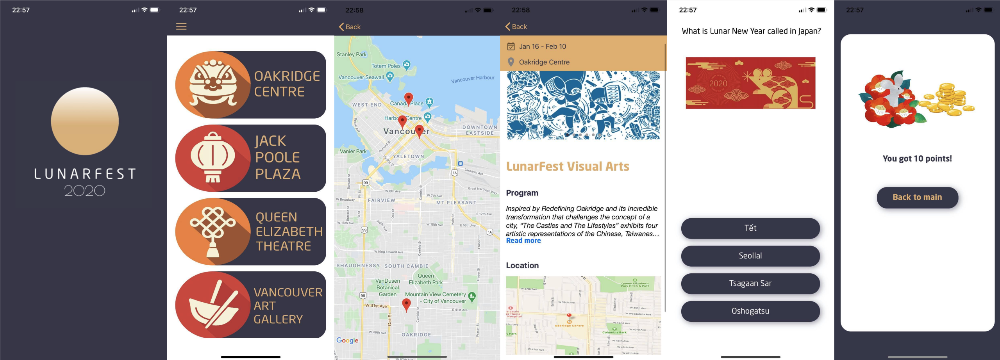

# 🌔 2020 Lunar Fun iOS App 🌖
A festival event app thats made for 2020 Lunar Fest

## Screenshots
  

[Mock Up Demo](https://drive.google.com/file/d/1MgebUd3RM8cng_BKBV1ZoHm4med0EJ7s/view?usp=sharing)

## Table of contents
* [General info](#general-info)
* [Technologies](#technologies)
* [Setup](#setup)
* [Features](#features)
* [Status](#status)
* [Contact](#contact)

## General info
Lunar Fest is an annual festival organized by Asian-Canadian Special Events Association. 
The festival started in 2009 and built to be a Vancouver Winter Olympic Legacy event. The festival collaborates with
many Asian and Canadian communities to celebrate one of the oldest traditions for many Asian cultures the Lunar New Year. 

This app was created by a team of BCIT students in just one month with no prior knowledge of mobile app development.
The app was a built upon the idea of the [TAIWANfest Fun Stop App](https://github.com/jasonwei0224/TAIWANfest-Fun-Stop-Android-App)
where it allow user to various festival booth to scan a QR code to collect points. 
Our team made modifications to fit the app into the LunarFest event as it is longer and span across several locations.
Modifications Include: 
* Point System - user can collect points through visiting booths and doing daily quiz
* Daily Quiz to keep user interested
* Redemption of points that user can use onsite 
* Update festival locatio map to use google maps
* Changed UI Design 

[Android](https://play.google.com/store/apps/details?id=ca.acsea.funstop&hl=en) 
[iOS](https://apps.apple.com/ca/app/lunar-fun-app/id1476290487)

## Technologies
* Swift (Xcode)
* Firebase
* Google Maps

## Setup
To download the app please visit:  
[Android](https://play.google.com/store/apps/details?id=ca.acsea.funstop&hl=en) 
[iOS](https://apps.apple.com/ca/app/lunar-fun-app/id1476290487)

## Features
List of features ready and TODOs for future development
* User Login
* Daily Quiz for user to play and collect points
* User profile page showing points user collected
* LunarFun Game - passport type game get user to visit different festival booths
* QR Code Scanner allow user to scan different stations
* Redemption of points for prizes
* Festival information including embeded map

## Status
Project is: _finished_

## Contact
This document was originally created by: 

* [@jasonwei0224](https://www.linkedin.com/in/jasonwei0224/) - Team lead

duplicated and modified with permission.

Android:
* [@SangwookYun](https://github.com/SangwookYun)
* [@Pual293](https://github.com/paul923)
* [@cinomed88](https://github.com/cinomed88)
* [@erickkkg7](https://github.com/erickkkg7)

iOS
* [@sxrg](https://github.com/sxrg) +UI, AppIcon Design
* [@ginajhkim](https://github.com/ginajhkim)
* [@yunseonghur](https://github.com/yunseonghur)
